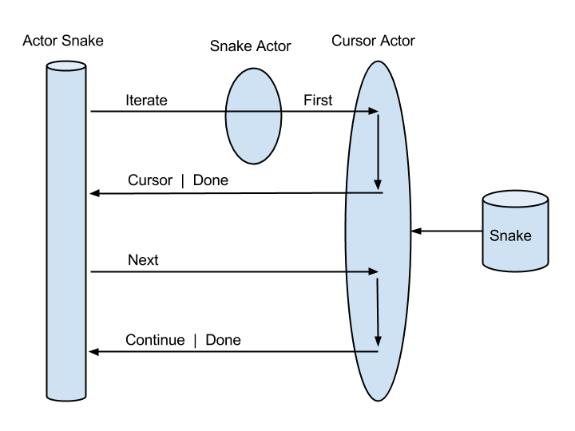

Snake
=====

A snake is a lazy asynchronous collection with lazy filtering, lazy sorting, lazy dropping and lazy taking.

    trait Snake[T] extends Queryable[Snake, T] {
      def continuation: Continuation[T]
    
      def size: Future[Int]
    }

    trait Queryable[M[_], T] {
      def filter(predicate: T => Boolean): M[T]
    
      def sorted(implicit ordering: Ordering[T]): M[T]
    
      def drop(skip: Int): M[T]
    
      def take(limit: Int): M[T]
    
      def :+(query: Query[T]): M[T]
    }

The query object provides a way to encapsulate filtering, ordering, dropping (or skipping) and taking (or limiting) into a single convenient package.

    case class Query[T](
      predicate: Option[Predicate[T]],
      
      ordering: Option[Ordering[T]],
      
      skip: Option[Int],
      
      limit: Option[Int]) extends Queryable[Query, T]

Actor Snake
-----------

An actor snake is an implementation of the snake abstraction with an underlying collection encapsulated in another snake that is embedded in another actor. This provides a way to abstract an arbitrary collection from one actor to another.

So, the actor snake can be viewed as the client and the actor server can be viewed as the server.

The snake implementations also include configurable and transparent grouping for efficiency.

